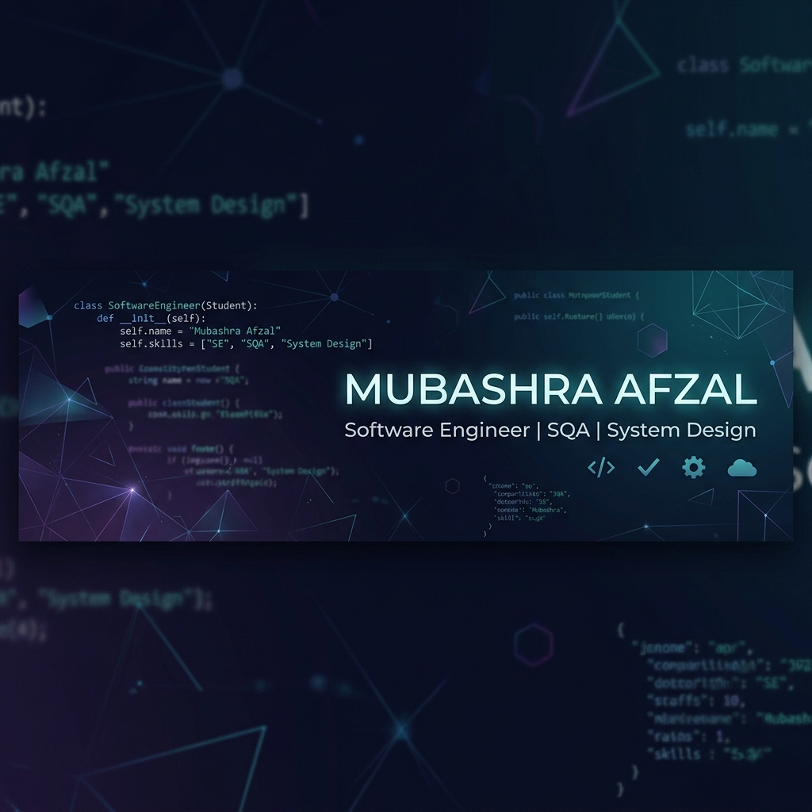

  

# Hi there, I'm Mubashra Afzal 👋
### Software Engineering Student | FAST NUCES (CFD) | Class of 2027

  
  
  

---

### 🚀 About Me
I'm a software engineering student who cares deeply about what happens **after** the code is written. My focus sits at the intersection of **Quality Engineering**, **Clean System Design**, and **Automated Testing** — because software that works is only half the job.

- 🎓 Studying at **FAST NUCES, CFD Campus**.
- 🛠️ Passionate about building robust, scalable systems and ensuring high-quality delivery.
- 🎯 Open to internships and collaborative projects in SQA and Backend Development.

---

### 🛠️ Tech Stack

#### 💻 Languages

#### 🌐 Web Development

#### 🧪 Testing & QA

#### ⚙️ Tools & DevOps

---

### 📈 Currently Building Skills In:
- 🧪 **Automated testing** with Selenium & Cucumber (BDD)
- 🏗️ **System architecture** & database design
- 🔄 **Agile workflows** & project delivery
- 🏛️ Mastering **OOP & SOLID** principles

---

### 📜 Certifications
- 🏆 **Google Project Management Certificate**
- 🥈 **Google Agile Essentials**
- 🤖 **Machine Learning for All** (Coursera)
- 💬 **Prompt Engineering for ChatGPT**
- 🌐 **AI for Everyone** — Andrew Ng

---

### 📂 Featured Projects

#### 🏆 OffTheField - Job Management System
*Full-stack platform for sports career management.*
- **Tech:** PHP, MySQL, JavaScript (AJAX), HTML/CSS
- **Key Features:** Secure authentication, real-time CRUD operations, and responsive dashboard.

#### 📊 QuickPOS Landing Page
*Modern, high-conversion landing page for a Point of Sale system.*
- **Tech:** HTML, CSS, JavaScript
- **Focus:** Premium UI/UX, responsive design, and performance.

#### 🔄 Mesh Circular Shift Visualizer
*Technical tool for visualizing complex mesh algorithms.*
- **Tech:** JavaScript, Algorithms
- **Focus:** Computational geometry and algorithm visualization.

---

### 🏆 GitHub Trophies

  

---

### 📫 Connect with me:

  
  

  
  

---

📍 FAST NUCES, CFD Campus · Open to internships & collaborations

